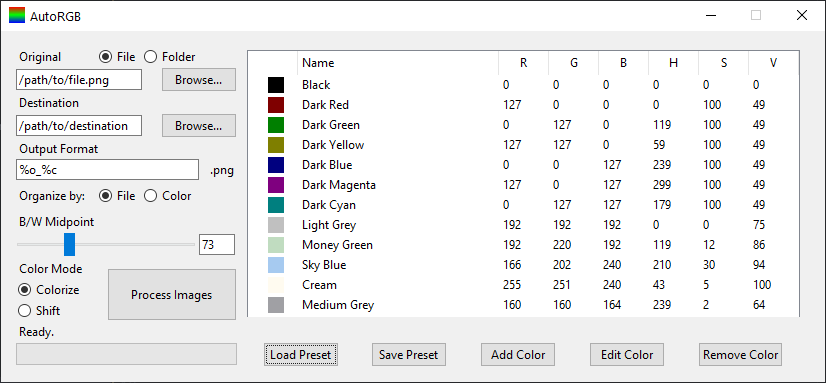

# AutoRGB

AutoRGB is a small program used to convert a .PNG image (or group of images) to a list of colors without needing to open any image editing software. It is intended to save time for anyone who routinely needs to create a large batch of icons, banners, etc. in a variety of colors.

At present, the software only supports .PNG format images. It also supports transparent backgrounds, provided the top-left pixel of the image is fully transparent.

## Installation

**OS X & Linux:**

There is not currently a binary build for OS X or Linux, but the program can still be used, provided Python 3 all the necessary Python libraries are installed (tkinter, PIL, and several libraries already bundled with Python by default). Then, simply run autorgb.py from the autorgb folder.

**Windows:**

The latest Windows binary can be downloaded from the [Releases](https://github.com/joshjaysalazar/AutoRGB/releases) page.

## Release History

* 0.2 Alpha
    * ADDED: HSV values to the color table
    * ADDED: Ability to edit colors on the table
    * ADDED: Color swatches now show in the table
    * ADDED: Additional shortcodes for HSV to file output
    * ADDED: More things in the main window now have tooltips when hovered over
    * ADDED: AutoRGB now has its very own icon!
    * ADDED: A black/white midpoint slider to adjust lightness/darkness of output images
    * ADDED: "Shift" mode
    * CHANGED: Color picker window has been replaced with a custom window with sliders for RGB and HSV
    * CHANGED: Each function which opens a file browser now has a default location, and each browse function will remember the last location used independent of one another while the program is open
    * REMOVED: "Average" mode
    * FIXED: Antialiased edges were sometimes ignored and looked strange, but should now look normal after processing
    * FIXED: Pure white pixels would be darkened if the target color was dark, but should now remain white under normal circumstances
* 0.1a Alpha
    * ADDED: A sorting option for the output
* 0.1 Alpha
    * Initial release
